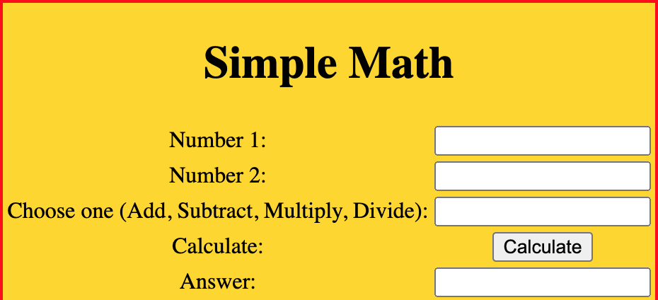
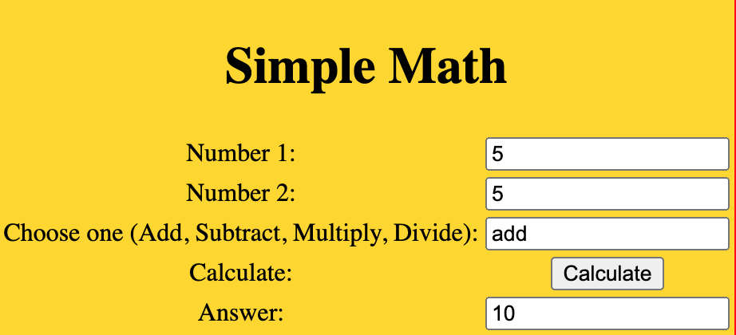
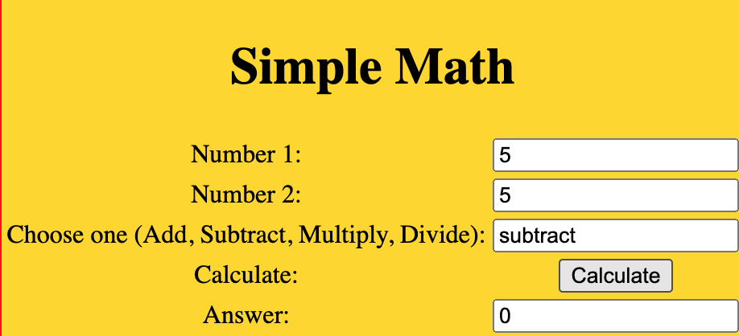
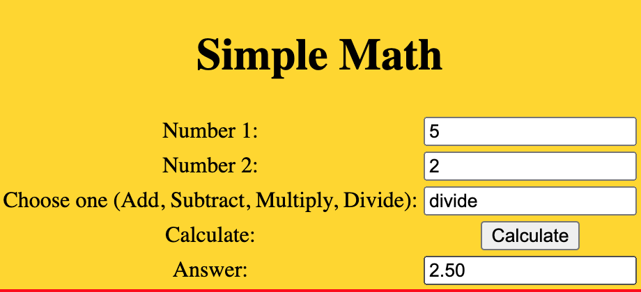
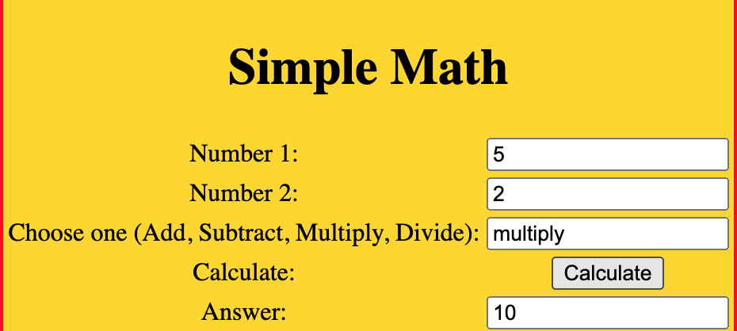
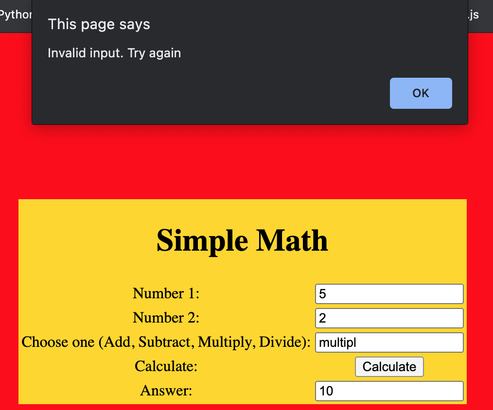

# react.js
This was a simple little app that was the first time I was actually able to do something in react.js. Hopefully, I can put together more exciting projects in the future. I love this framework.

